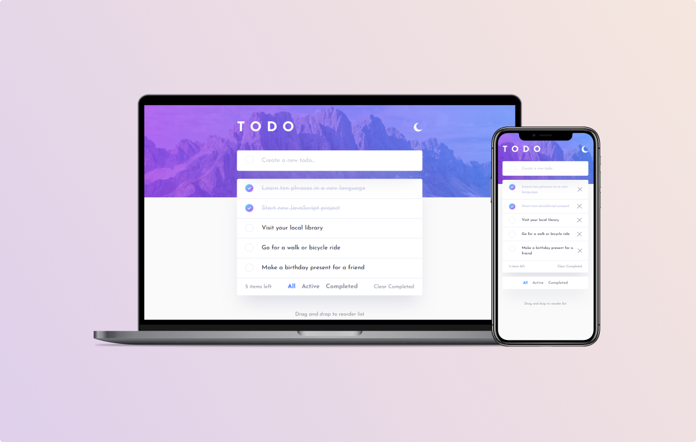

# Frontend Mentor - Todo app solution

This is a solution to the [Todo app challenge on Frontend Mentor](https://www.frontendmentor.io/challenges/todo-app-Su1_KokOW). Frontend Mentor challenges help me improve my coding skills by building realistic projects.

## Overview

### Screenshot

### Links

- Solution URL: [https://react-todo-ivcenko.netlify.app/](https://react-todo-ivcenko.netlify.app/)
- Live Site URL: [https://www.frontendmentor.io/solutions/javascript-todo-app-with-nice-alert-animation-and-drag-and-drop-Tqsd_NQ7Z](https://www.frontendmentor.io/solutions/javascript-todo-app-with-nice-alert-animation-and-drag-and-drop-Tqsd_NQ7Z)

## My process

It may look like a simple project with add and delete functionality. But the design of this project presents many challenges. Different layouts on desktop and mobile screens, dark and light themes, hover states. This project was built with React. For state management, I used the React Context API, and for animation, I used Framer Motion. I did not fully finish this project, but I always return to add something more.

### Built with

- Semantic HTML5 markup
- Flexbox
- CSS Grid
- Mobile-first workflow
- [React](https://reactjs.dev/) - JS library
- [Styled Components](https://styled-components.com/) - For styles
- [Framer Motion](https://www.framer.com/motion/) - For animations

### What I learned

    * How to use Framer Motion
    * Complex responsive layout
    * React Context API
    * Gradient border color on hover

### Continued development

Framer Motion is a great library for animation. and I'll use it in my projects in the future. Simple animations can be created using only CSS, but when you need to animate when a component leaves the DOM or drag and drop functionality, Framer Motion is a great solution for that. As well, I found that positioning elements can be easily implemented with a grid instead of position relative and absolute. In every next projects I use more grid layout.

## Author

- Website - [Sergejs Ivcenko](https://www.your-site.com)
- GitHUb - [Sergio0831](https://github.com/Sergio0831)
- LinkedIn - [Sergejs Ivcenko](https://www.linkedin.com/in/ivcenko/)
- Frontend Mentor - [@Sergio0831](https://www.frontendmentor.io/profile/Sergio0831)

## Acknowledgments

When I completed this project, I looked at other people's solutions. And it's so great to see so many different solutions just for one project.
